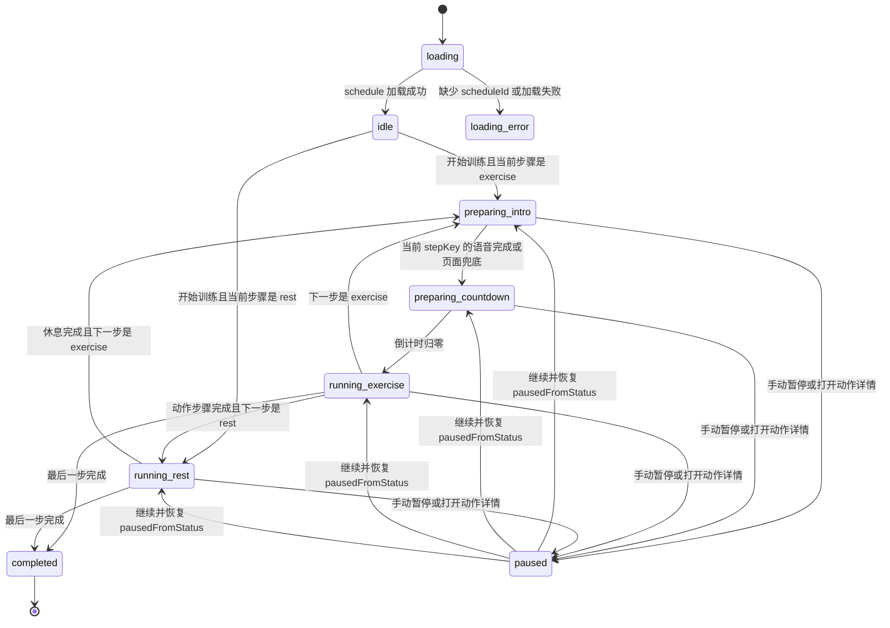

# `/training` 整体流程分析

## 1. 当前链路概览

- 入口路由是 `/training?scheduleId=<id>`，`app/training/page.tsx` 渲染 `WorkoutSessionPage`，页面从 URL 读取 `scheduleId`。
- 页面层通过 `getWorkoutSchedule(scheduleId)` 加载 `WorkoutSchedule`，加载成功后用 `getWorkoutLoopConfig()` 和 `buildWorkoutTimeline()` 生成线性 `steps`。
- `activeStepIndex` 是当前步骤索引，`activeStep` 从 `steps` 派生；动作步骤使用 `activeExerciseStep`，休息步骤使用 `activeRestStep`。
- 当前动作、休息预览、示范图和训练项目列表都从 `activeStepIndex`、`getRelevantExerciseStep()`、`buildWorkoutSessionListView()` 派生。
- 页面维护 `remainingSeconds` 作为当前步骤剩余时间，`elapsedSeconds` 作为总训练时长。
- 语音 hook `useWorkoutVoiceBroadcast()` 接收页面提供的当前步骤、执行状态、计时、计次和偏好，再把这些输入转成语音 session cue。
- `WorkoutVoiceSession` 只管理 Web Speech job、cue queue、去重、取消、失败和开发诊断。
- `saveWorkoutSessionResult()` 只在完成时保存结果；保存失败不应回滚当前页面完成态。

## 2. 页面训练执行状态

目标状态模型：

- `idle`：计划已加载但训练未开始，或用户在未开始时切换步骤。
- `preparing_intro`：动作提示阶段，页面等待当前步骤 key 对应的语音完成或静默兜底。
- `preparing_countdown`：准备倒计时阶段，页面每秒推进 `preparationCountdown`。
- `running_exercise`：动作执行阶段，动作计时或计次可以推进。
- `running_rest`：休息执行阶段，休息倒计时可以推进。
- `paused`：暂停态，保留 `pausedFromStatus`，继续时恢复暂停前阶段。
- `completed`：当前页面训练完成态，先于服务端保存结果成立。
- `loading_error`：缺少 `scheduleId` 或加载失败，禁止沿旧步骤继续运行。

每个当前步骤状态必须记录：

- `stepKey`：`${sessionId}:${step.id}:${stepIndex}`，用于忽略旧步骤回调。
- `stepIndex`：当前 timeline index。
- `version`：每次新步骤初始化递增，用于人工排查异步归属。
- `preparationCountdown`：只在当前步骤处于准备倒计时时作为页面事实源。
- `pausedFromStatus`：只在 `paused` 时记录继续后恢复到哪个状态。

## 3. 状态拥有者边界

页面层拥有：

- schedule 加载状态、加载错误和当前本地完成态。
- `activeStepIndex`、`remainingSeconds`、`elapsedSeconds`。
- 训练是否开始、当前步骤执行状态、准备倒计时、动作或休息是否可以计时。
- 暂停和继续的状态恢复规则。
- 跳步、跳过休息、结束训练和完成提交的入口。

语音 hook 拥有：

- 本地语音偏好读取和保存。
- 浏览器是否支持语音播报的适配判断。
- 将页面训练执行状态映射为语音 cue 调用。
- 向页面回传带 `stepKey` 的准备提示完成事件。

语音 hook 不得拥有：

- 动作是否处于准备中。
- 动作是否可以开始计时。
- 当前步骤是否应该完成或跳转。

语音 session 拥有：

- Web Speech `onstart/onend/onerror` 生命周期。
- cue queue、优先级、去重、过期、取消和 stale event 诊断。
- Web Audio beep 解锁和播放。
- 语音失败、不可用和 blocked 状态。

语音 session 不得拥有：

- 页面训练状态迁移。
- 准备倒计时是否开始。
- 动作计时是否放行。
- 当前训练步骤或完成态。

服务端拥有：

- `WorkoutSchedule` 和 `WorkoutSessionResult` 的持久化事实。
- 完成结果保存后的 schedule 状态。

服务端不得拥有：

- 当前页面会话是否已经进入完成反馈。
- 当前步骤计时、准备倒计时、暂停继续等客户端运行状态。

## 4. 状态迁移

控制操作迁移：

- 开始：根据当前 `activeStep` 初始化 `preparing_intro` 或 `running_rest`，并记录新的 `stepKey`。
- 暂停：当前 active 状态进入 `paused`，保留 `pausedFromStatus`，停止准备倒计时、动作计时、休息计时和语音 cue。
- 继续：从 `pausedFromStatus` 恢复，不重新创建准备 key，不重播旧动作提示。
- 上一个 / 下一个 / 跳过休息 / 点击训练项目：取消当前语音 cue，递增版本，为新步骤创建新的 `stepKey` 和执行状态。
- 打开动作详情：进入 `paused`，总训练时长是否停止由手动暂停标记决定；当前实现保留“只有手动暂停才暂停总时长”的语义。
- 关闭动作详情：只关闭抽屉，不自动恢复训练，用户继续点击“继续”恢复暂停前状态。
- 完成训练：进入 `completed`，清空准备状态和当前步骤剩余时间，然后异步保存结果。

## 5. 异步来源和归属

- Web Speech `onstart`：只更新语音 session 激活和 speaking 状态，不更新页面训练执行状态。
- Web Speech `onend`：语音 session 可以调用 `onPreparationIntroComplete(stepKey)`，页面必须校验 `stepKey` 仍是当前步骤。
- Web Speech `onerror`：只进入语音失败诊断；页面通过静默兜底继续推进准备流程。
- speech completion fallback timer：只触发当前语音 job 的完成或失败，不得绕过页面 `stepKey` 校验。
- speech unavailable fallback timer：只模拟 cue 结束；页面仍按 `stepKey` 判断是否可推进。
- 页面准备提示兜底 timer：当前步骤停留在 `preparing_intro` 且未暂停时触发，防止语音回调缺失导致永久等待。
- 页面准备倒计时 timer：只在 `preparing_countdown` 且 `stepKey` 匹配时递减。
- 动作 / 休息 timer：只在 `running_exercise` 或 `running_rest` 且 `stepKey` 匹配时递减 `remainingSeconds`。
- 计次计算：由 `remainingSeconds` 派生，不直接写训练状态。
- 跳步取消：取消语音 cue 并生成新 `stepKey`，旧 cue 后续回调必须被忽略。
- 完成提交 promise：成功后更新本地 plan status；失败只记录错误，不回滚 `completed`。

## 6. 卡住问题复盘

- “听到开始”只说明语音 cue 播到了最后一秒，不等于页面已经进入 `running_exercise`。
- 旧实现里页面有准备阶段，但语音 hook 仍用 `preparationCountdown > 0` 推导准备事实；这会让语音和页面同时表达“准备中”。
- 如果 Web Speech `onend`、fallback 或取消时序没有稳定回到页面，动作会停在准备阶段，动作 timer 因 `canRunActiveStep` 为 false 而不推进。
- 暂停/继续能短暂推进，说明动作 timer 本身可运行；随后停止说明准备 gate 又被旧派生状态或旧 key 阻塞。
- 修复后，动作是否能计时只看页面 `WorkoutExecutionState`；语音失败、取消、关闭或不支持只影响播报和诊断。

## 7. 验证矩阵

自动化测试：

- 状态机：动作提示完成后进入准备倒计时。
- 状态机：准备倒计时归零后进入 `running_exercise`。
- 状态机：语音回调缺失时页面兜底能调用同一条状态迁移。
- 状态机：语音失败不阻塞页面准备流程。
- 状态机：动作运行暂停后继续恢复 `running_exercise`。
- 状态机：准备倒计时暂停后继续恢复 `preparing_countdown`。
- 状态机：跳步后旧 `stepKey` 的准备、倒计时、计时、计次回调被忽略。
- 语音 session：准备 cue、倒计时 cue、计次 cue 和 beep cue 只跟随页面传入的执行状态。
- 语音 session：stale `onend/onerror/fallback` 不覆盖当前页面状态。

代码阅读验证：

- `WorkoutSessionPage` 不再用语音状态决定动作是否可以开始计时。
- `useWorkoutVoiceBroadcast` 不再通过 `preparationCountdown > 0` 推导动作准备事实。
- `WorkoutVoiceSession` 只根据页面提供的 `executionPhase` 选择 cue，不拥有训练放行状态。
- 语音设置、自检和开发日志不写当前步骤、剩余时间或准备阶段。
- `saveWorkoutSessionResult()` 的结果不回滚页面完成态。

需要用户明确允许后才能做的真实浏览器验证：

- Web Speech 正常播放时：开始训练 -> 动作提示 -> 3、2、1 -> 动作计时。
- 语音关闭时：开始训练 -> 静默准备 -> 动作计时。
- 浏览器阻止或无语音支持时：语音状态可诊断，训练不被卡住。
- 训练中暂停、继续、跳步、关闭语音和结束训练时，不播放旧步骤语音。
- 动作详情打开时暂停，关闭后不自动继续，点击继续后恢复原状态。
